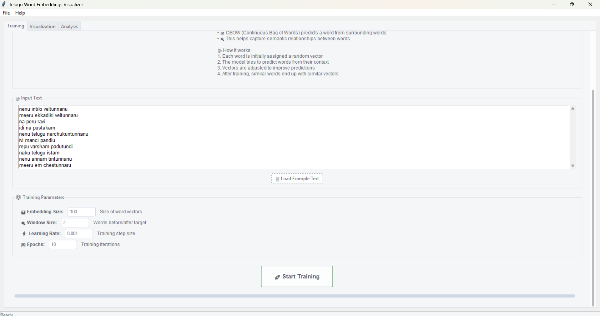
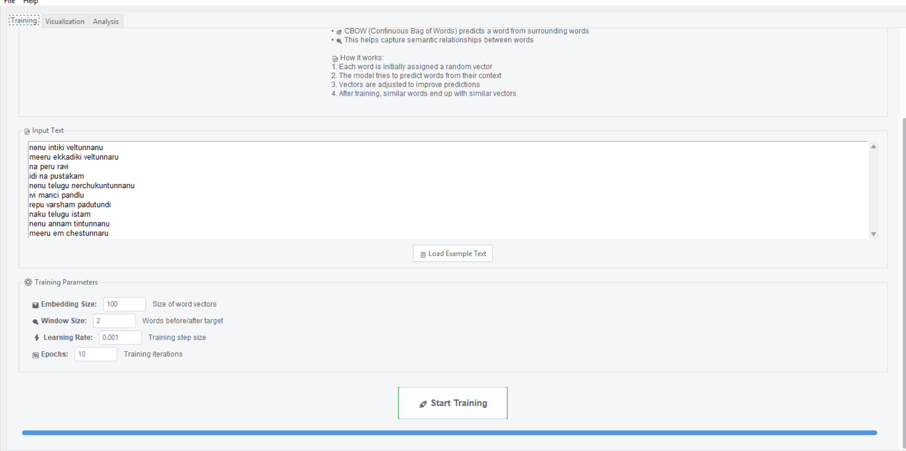
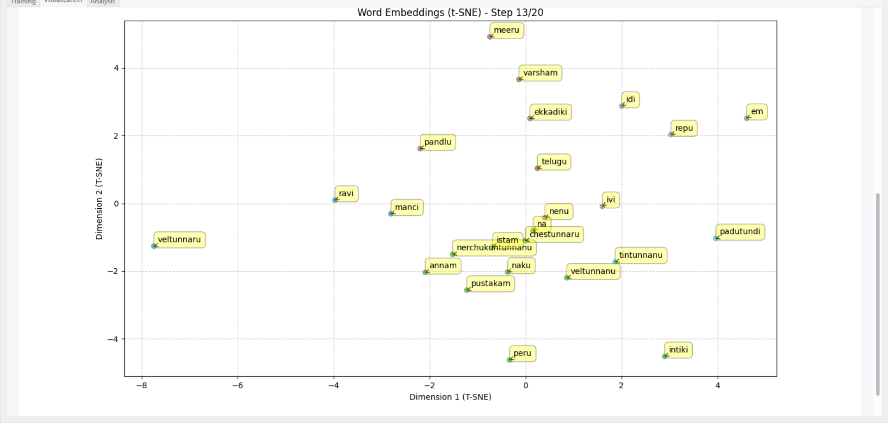
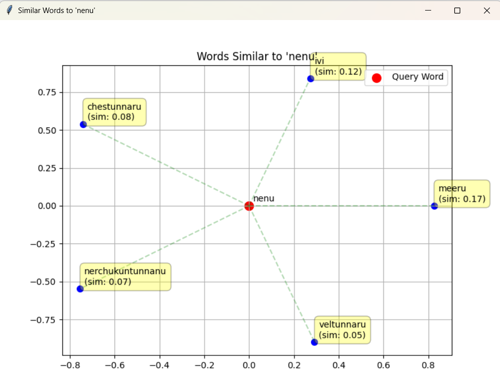
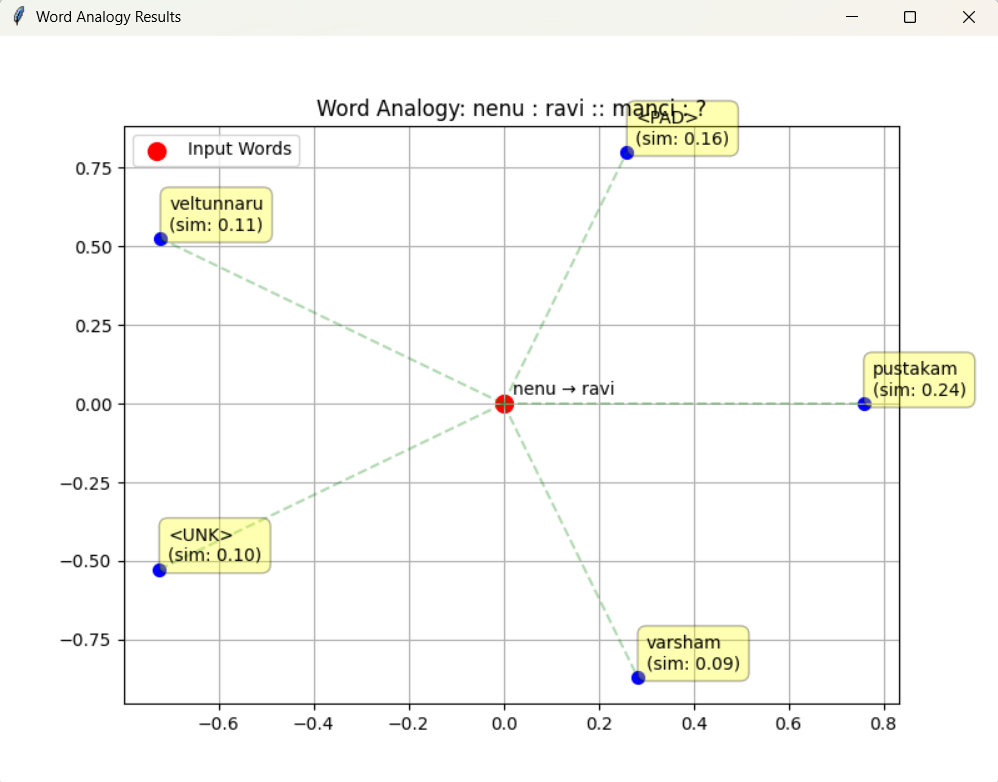
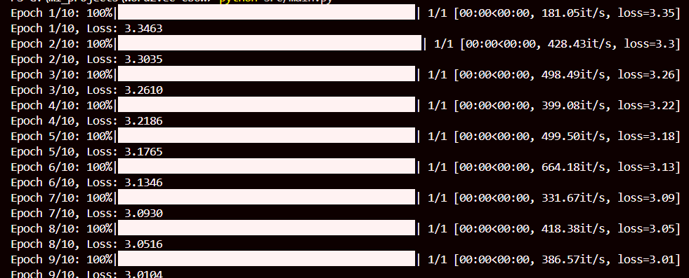

# Telugu Word Embeddings Visualizer

An interactive tool for training and visualizing word embeddings for Telugu text (written in English script). This application helps users understand how words relate to each other in the Telugu language through visual exploration.

## Screenshots

### Main Window


### Training Tab


### Visualization Tab


### Analysis Tools


#### Similar Words


#### Word Analogies


#### Training Progress


## Features

- 🚀 **Interactive Training**:
  - Train word embeddings using CBOW (Continuous Bag of Words) model
  - Adjustable parameters (embedding size, window size, learning rate)
  - Real-time training progress visualization
  - Example Telugu text (in English script) provided

- 📊 **Advanced Visualization**:
  - Choose between t-SNE and PCA visualization methods
  - Interactive animations showing embedding space organization
  - Adjustable animation speed
  - Zoom and pan capabilities
  - Detailed step-by-step explanations

- 🔍 **Analysis Tools**:
  - Find similar words with visual representation
  - Explore word analogies (e.g., "anna : akka :: mama : ?")
  - Interactive results visualization
  - Cluster analysis and relationship exploration

## Installation

1. Clone the repository:
```bash
git clone https://github.com/yourusername/telugu-word-embeddings-visualizer.git
cd telugu-word-embeddings-visualizer
```

2. Create a virtual environment (recommended):
```bash
python -m venv venv
source venv/bin/activate  # On Windows: venv\Scripts\activate
```

3. Install dependencies:
```bash
pip install -r requirements.txt
```

## Usage

1. Run the application:
```bash
python src/main.py
```

2. Training:
   - Enter Telugu text (in English script) in the Training tab
   - Adjust training parameters if needed
   - Click "Start Training" to begin
   - Monitor progress in real-time

3. Visualization:
   - Switch to the Visualization tab after training
   - Choose between t-SNE and PCA methods
   - Adjust animation speed
   - Use toolbar to zoom and explore
   - Hover over points to see word details

4. Analysis:
   - Use the Analysis tab to find similar words
   - Explore word analogies
   - Visualize word relationships

## Example Text

The application comes with example Telugu text (in English script). Click "Load Example Text" in the Training tab to use it. You can also input your own Telugu text in English script.

Example format:
```
nenu intiki veltunnanu
meeru ekkadiki veltunnaru
na peru ravi
idi na pustakam
```

## Parameters

- **Embedding Size**: Size of word vectors (default: 100)
- **Window Size**: Number of context words to consider (default: 2)
- **Learning Rate**: Training step size (default: 0.001)
- **Epochs**: Number of training iterations (default: 10)

## Visualization Methods

1. **t-SNE**:
   - Better for seeing word relationships and clusters
   - Preserves local structure
   - More detailed but slower
   - Best for exploring similar words

2. **PCA**:
   - Shows global structure of relationships
   - Faster computation
   - Good for initial exploration
   - Better for understanding overall distribution

## Requirements

- Python 3.7+
- PyTorch
- NumPy
- Pandas
- Matplotlib
- Plotly
- scikit-learn
- ttkthemes
- PIL
- tqdm
- seaborn

## Contributing

Contributions are welcome! Please feel free to submit a Pull Request.

## License

This project is licensed under the MIT License - see the LICENSE file for details.

## Project Structure

```telugu-word-embeddings-visualizer/
├── src/
│   ├── main.py              # Application entry point
│   ├── model/
│   │   ├── cbow.py         # CBOW model implementation
│   │   └── trainer.py      # Model training logic
│   ├── data/
│   │   └── preprocessor.py # Text preprocessing
│   ├── gui/
│   │   └── main_window.py  # GUI implementation
│   └── visualization/
│       └── embeddings_viz.py # Visualization tools
├── docs/
│   └── images/             # Documentation images
├── requirements.txt        # Project dependencies
└── README.md              # This file
```

## Acknowledgments

- Word2Vec paper: Mikolov et al. (2013)
- t-SNE implementation: van der Maaten and Hinton (2008)
- PyTorch team for the deep learning framework

## Authors

- Samminga Sainath Rao

## Contact

- GitHub: [@sammingasainath](https://github.com/sammingasainath)
- Email: sammingasainathrao@gmail.com
